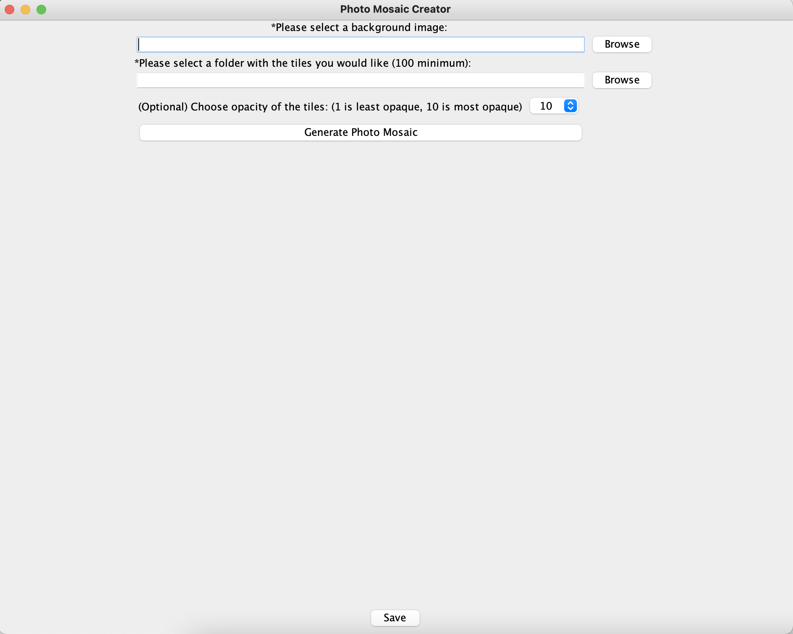
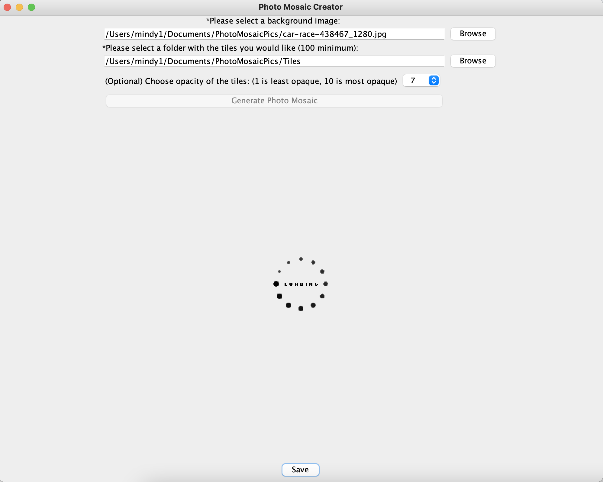
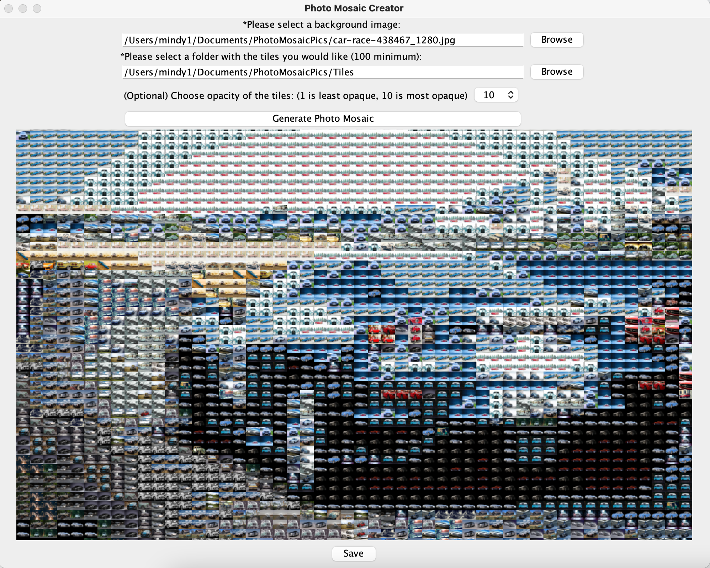
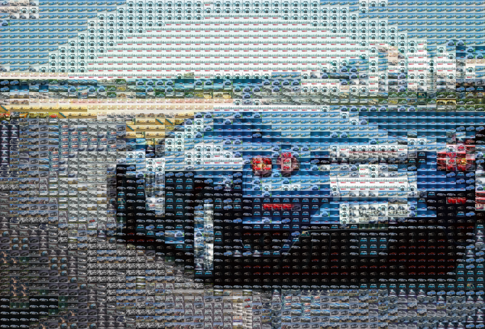
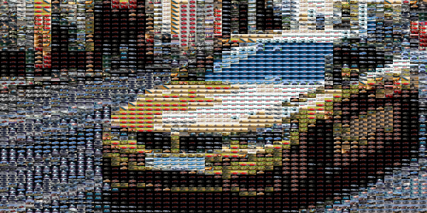

# Photo Mosaic Generator
The idea and algorithm for this project came from 
https://robertheaton.com/2018/11/03/programming-project-4-photomosaics/.

This project creates a photo mosaic, using the images
that the user chooses. The user must pick a background
image, and at least 100 tiles. They can also optionally 
choose how opaque they would like the tiles to be.

The user interface looks like this:

Once the user chooses the background image and tiles
they want to use, they can press the button to 
generate the photo mosaic.

The user interface will then display the following:

Finally, when the photo mosaic is complete, it
displays in the user interface like this:

The user can choose to save the photo mosaic if they
would like.

The above image has an opacity of 10. The same image
with an opacity of 7 looks like:

Another example of a photo mosaic generated by this
application is:

For convenience of being able to test out this application,
I have included a folder [here](Images/PhotoMosaicPics) that
has the background image I used, and the folder of
100 tiles.